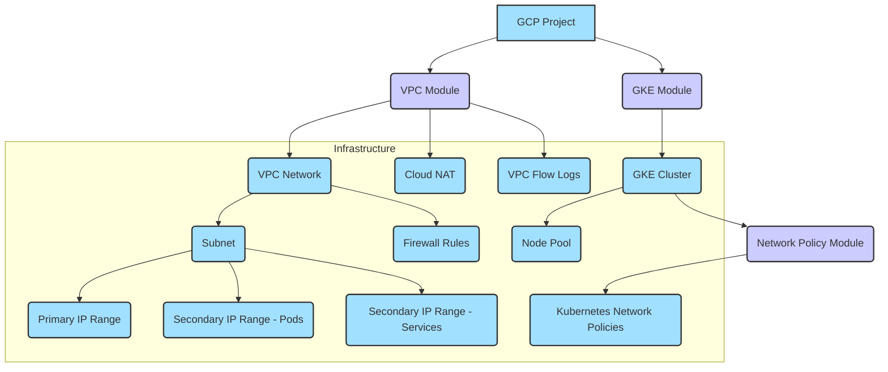

# GKE Cluster Deployment with Terraform

This project provides a simple and modular example of deploying a Google Kubernetes Engine (GKE) cluster using Terraform, focusing on core networking and basic security practices. It's designed as a starting point for DevOps engineers to understand how to deploy a GKE cluster using infrastructure as code.

## Overview

This repository contains Terraform modules to deploy:
- A custom VPC network with necessary subnets for GKE.
- A private GKE cluster.
- Basic Kubernetes Network Policies for pod isolation (optional).

The goal is to demonstrate a clean, modular Terraform structure for deploying a GKE cluster.

## Prerequisites

Before you begin, ensure you have the following installed:

1.  **Google Cloud SDK:** For authenticating with GCP.
    [Install Google Cloud SDK](https://cloud.google.com/sdk/docs/install)
2.  **Terraform (v1.0+):** For managing infrastructure as code.
    [Install Terraform](https://developer.hashicorp.com/terraform/downloads)
3.  **kubectl:** For interacting with the Kubernetes cluster.
    [Install kubectl](https://kubernetes.io/docs/tasks/tools/)

You will also need a Google Cloud Platform account with billing enabled and appropriate permissions to create VPC networks, GKE clusters, and related resources.

## Deployment Steps

Follow these steps to deploy the GKE cluster:

### 1. Clone the Repository

Start by cloning this repository to your local machine:

```bash
git clone https://github.com/yourusername/gke-terraform-demo.git
cd gke-terraform-demo
```

### 2. Run the Bootstrap Script

The `scripts/bootstrap.sh` script automates several initial setup steps:

- Checks for required tools (gcloud, terraform, kubectl).
- Authenticates with Google Cloud.
- Prompts for and sets the GCP Project ID if not already configured.
- Enables necessary GCP APIs.
- Creates a GCS bucket for Terraform state (if one doesn't exist).
- Copies `terraform.tfvars.example` to `terraform.tfvars` and replaces placeholders with your Project ID.
- Copies `backend.tf.example` to `backend.tf` and replaces the placeholder with your GCS bucket name.
- Runs `terraform init` to initialize the Terraform working directory.

Run the bootstrap script:

```bash
chmod +x scripts/bootstrap.sh
./scripts/bootstrap.sh
```

Follow the prompts in the script to configure your GCP project and Terraform backend.

### 3. Review and Customize Configuration

Navigate to the development environment directory:

```bash
cd environments/dev
```

Review and customize the `terraform.tfvars` file. This file contains all the configurable aspects of your GKE cluster and network:

```terraform
project_id = "YOUR_GCP_PROJECT_ID" # Ensure this is set correctly by the bootstrap script or update manually
project_name = "gke-demo"
region = "us-central1"
zone = "us-central1-a"
subnet_cidr = "10.0.0.0/24"
pod_cidr = "10.1.0.0/16"
service_cidr = "10.2.0.0/16"
master_ipv4_cidr_block = "172.16.0.0/28"
machine_type = "e2-micro"
min_node_count = 1
max_node_count = 2
initial_node_count = 1
environment = "dev"

# Set to true to deploy Kubernetes Network Policies for pod isolation
deploy_network_policies = false
```

You can adjust variables like `region`, `zone`, `machine_type`, and node counts based on your needs. Set `deploy_network_policies` to `true` if you want to include basic Network Policies.

### 4. Review the Deployment Plan

Generate and review the execution plan. This step shows you exactly what resources Terraform will create, modify, or destroy based on your configuration:

```bash
terraform plan
```

Carefully examine the output to ensure the planned changes match your expectations before proceeding.

### 5. Apply the Configuration

If the plan is satisfactory, apply the configuration to deploy the resources in your GCP project:

```bash
terraform apply
```

Type `yes` when prompted to confirm the deployment.

### 6. Connect to Your Cluster

Once the deployment is complete, you can connect to your GKE cluster using `kubectl`. The `scripts/connect.sh` script automates retrieving the cluster credentials and configuring `kubectl`:

```bash
cd ../.. # Navigate back to the project root
chmod +x scripts/connect.sh
./scripts/connect.sh
```

This script will use the Terraform outputs to get the cluster name, region, and project ID, then configure your local `kubectl` context. It will also verify the connection and list the cluster nodes.

### 7. (Optional) Deploy a Sample Application

You can deploy a simple application to test your cluster and network policies. From the project root directory, apply the sample deployment manifest:

```bash
kubectl apply -f kubernetes/manifests/deployment.yaml
```

Check the status of the deployed application and service:

```bash
kubectl get pods
kubectl get service demo-app
```

If you enabled Network Policies, you might need to adjust them to allow traffic to your application.

### 8. Clean Up

To avoid incurring unnecessary costs, remember to destroy the deployed infrastructure when you are finished:

Navigate back to the environment directory:

```bash
cd environments/dev
```

Run the destroy command:

```bash
terraform destroy
```

Type `yes` when prompted to confirm the destruction of resources.

## Detailed Architecture (Core Components)



## Terraform Best Practices Demonstrated

This project showcases the following Terraform best practices:

*   **Modularity:** Infrastructure components are organized into reusable modules (VPC, GKE, Network Policy).
*   **Input Validation:** Variables include validation rules to catch configuration errors early.
*   **Locals:** Used for consistent naming and simplifying expressions.
*   **Variables:** All configurable aspects are defined using variables.
*   **Conditional Logic:** Modules and resources can be conditionally deployed using `count`.
*   **Naming Conventions:** Consistent naming is used across resources and variables.
*   **Documentation:** Each module has a README, and the main README provides a clear overview and steps.
*   **Remote State:** Recommended configuration for using a GCS backend for state management.

## Contributing

Contributions are welcome! Please feel free to submit a Pull Request.

## License

This project is licensed under the MIT License - see the [LICENSE](LICENSE](LICENSE) file for details.
