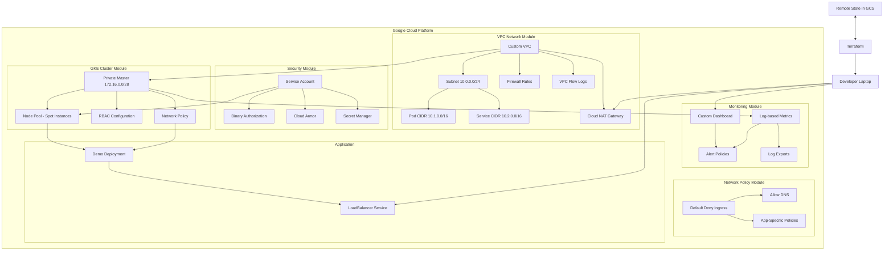

# Architecture Overview

This document provides a detailed architecture overview of the GKE cluster deployment using Terraform best practices.

## Infrastructure Diagram

## Module Descriptions

### 1. VPC Network Module

The VPC module creates a secure networking foundation:

- **Custom VPC**: Dedicated network for the cluster
- **Subnet Configuration**: Primary subnet with private Google access
- **Secondary IP Ranges**: Separate ranges for pods and services
- **Cloud NAT**: Enables outbound internet access for private nodes
- **Firewall Rules**: Follows the principle of least privilege
- **VPC Flow Logs**: Network traffic auditing for security monitoring

Security features:
- Default deny ingress rule
- Firewall logging
- Private Google access

### 2. Security Module

The security module implements GCP security best practices:

- **Service Account**: Custom service account with minimal permissions
- **Binary Authorization**: Optional validation of container images
- **Cloud Armor**: Optional security policies for services (WAF)
- **Secret Manager**: Secure storage for sensitive configuration
- **Organization Policies**: Optional security constraints 

### 3. GKE Cluster Module

The GKE module creates a hardened Kubernetes cluster:

- **Private Cluster**: Control plane with private endpoint
- **Node Configuration**:
  - Spot instances for cost savings
  - Minimal machine types
  - Secure boot and integrity monitoring
  - Encrypted disks (optional)
  
- **Security Features**:
  - Shielded nodes
  - Workload identity
  - Node auto-upgrade
  - Network Policy (Calico)
  - NodeLocal DNSCache
  - Application-layer secrets encryption
  - Dataplane V2

### 4. Network Policy Module

This module applies Kubernetes NetworkPolicy resources:

- **Deny All Ingress**: Default-deny base policy
- **Selective Allowances**: Granular rules by namespace and label
- **DNS Access**: Allow DNS resolution
- **Egress Control**: Optional restrictions on outbound traffic

### 5. Monitoring Module

The monitoring module provides security-focused observability:

- **Custom Dashboard**: GKE-specific performance and security metrics
- **Alert Policies**: Notifications for security events and anomalies
- **Log-based Metrics**: Security incident detection
- **Log Export**: Long-term storage for compliance and auditing

## Terraform Best Practices Implemented

1. **Modular Architecture**
   - Clear separation of concerns
   - Reusable modules with well-defined interfaces
   - Composable infrastructure design

2. **State Management**
   - Remote state in GCS bucket
   - State locking for concurrent operations
   - State versioning for recovery

3. **Security First Approach**
   - Principle of least privilege
   - Defense in depth with multiple security layers
   - Private-by-default network architecture

4. **Resource Naming and Tagging**
   - Consistent naming conventions
   - Comprehensive labeling strategy
   - Environment-based segregation

5. **Code Structure**
   - DRY (Don't Repeat Yourself) principle
   - Properly documented variables
   - Logical organization of resources

6. **Dynamic Configuration**
   - Environment-specific variable files
   - Feature flags for optional components
   - Sensible defaults with override capability

## Deployment Workflow

1. **Bootstrap Phase**: Sets up prerequisites (APIs, state bucket)
2. **Configuration Phase**: Customizing terraform.tfvars
3. **Planning Phase**: Previewing changes with terraform plan
4. **Application Phase**: Creating infrastructure with terraform apply
5. **Connection Phase**: Configuring kubectl with credentials
6. **Testing Phase**: Deploying sample application
7. **Cleanup Phase**: Destroying infrastructure when done

## Security Considerations

The architecture implements multiple layers of defense:

1. **Network Security**
   - Private GKE cluster
   - VPC-native networking
   - Firewall rules with least privilege
   - Default deny with explicit allow rules

2. **Identity and Access**
   - Custom service accounts with minimal permissions
   - Workload Identity for pod-level authentication
   - RBAC for Kubernetes authorization

3. **Node Security**
   - Shielded nodes with Secure Boot
   - Node auto-upgrading
   - OS hardening (Container-Optimized OS)
   - Encrypted boot disks (optional)

4. **Workload Security**
   - Network Policies for pod-to-pod traffic control
   - Binary Authorization (optional)
   - Pod Security Policies (optional)

5. **Data Protection**
   - Secrets encryption
   - Secret Manager integration
   - TLS for in-transit encryption

## Cost Optimization

While maintaining security, costs are optimized through:

1. **Compute Efficiency**
   - Spot instances (up to 91% discount)
   - e2-micro machine types
   - Minimal node count
   - Autoscaling configuration

2. **Networking Costs**
   - Regional deployment
   - Single zone configuration
   - Minimal egress with private clusters

3. **Storage Optimization**
   - Minimal persistent disk usage
   - Standard disk type by default