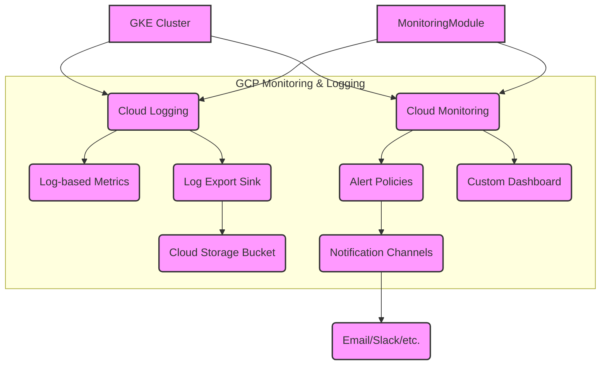

# Monitoring Module

This module configures Google Cloud Monitoring and Logging resources for a GKE cluster. It includes options for creating log-based metrics, alert policies, notification channels, and a custom dashboard.

## Features

*   Configures Cloud Monitoring and Cloud Logging for a GKE cluster.
*   Optionally creates security-related log metrics (e.g., authorization failures, pod security violations).
*   Optionally creates alert policies based on key cluster metrics (e.g., CPU/memory usage).
*   Optionally configures notification channels (e.g., email, Slack) for alerts.
*   Optionally creates a custom monitoring dashboard for the cluster.
*   Optionally enables log export to a Cloud Storage bucket.
*   Input validation for key variables.

## Usage

This module is typically called from an environment-specific `main.tf` file (e.g., `environments/dev/main.tf`). It is often made conditional based on an environment variable.

```terraform
module "monitoring" {
  source = "../../modules/monitoring"
  count  = var.enable_monitoring ? 1 : 0 # Example: Make module deployment conditional

  project_id   = var.project_id
  project_name = var.project_name
  cluster_name = module.gke.cluster_name # Example: Get cluster name from GKE module output
  environment  = var.environment

  enable_security_metrics   = true # Example: Enable security metrics
  enable_alerts             = true # Example: Enable alerts
  enable_notifications      = var.enable_monitoring_notifications # Example: Control notifications via variable
  notification_channels     = var.monitoring_notification_channels # Example: Pass channel names
  notification_channels_config = var.monitoring_notification_channels_config # Example: Pass channel config (sensitive)
  create_dashboard          = true # Example: Create dashboard
  enable_log_export         = var.enable_log_export # Example: Control log export via variable
  log_storage_location    = var.log_storage_location # Example: Pass log storage location
  log_retention_days      = var.log_retention_days # Example: Pass log retention days
  log_bucket_force_destroy = var.log_bucket_force_destroy # Example: Control force destroy

  depends_on = [module.gke] # Depends on the GKE cluster being created
}
```

## Inputs

| Name                           | Description                                                                 | Type                                                                 | Default     | Required |
| :----------------------------- | :-------------------------------------------------------------------------- | :------------------------------------------------------------------- | :---------- | :------- |
| `project_id`                   | The ID of the project where monitoring resources will be created            | `string`                                                             | n/a         | yes      |
| `project_name`                 | The name of the project (used for naming resources)                         | `string`                                                             | n/a         | yes      |
| `cluster_name`                 | Name of the GKE cluster to monitor                                          | `string`                                                             | n/a         | yes      |
| `environment`                  | Environment name (e.g., dev, prod)                                          | `string`                                                             | `"dev"`     | no       |
| `enable_security_metrics`      | Whether to enable security-related log metrics                              | `bool`                                                               | `true`      | no       |
| `security_metrics`             | Map of security metrics to create. Filters should use `CLUSTER_NAME` and `PROJECT_ID` placeholders. | `map(object({ description = string, filter = string }))` | `{...}`     | no       |
| `enable_alerts`                | Whether to enable alert policies                                            | `bool`                                                               | `true`      | no       |
| `alerts`                       | Map of alerts to create. Filters should use `CLUSTER_NAME` and `PROJECT_ID` placeholders. | `map(object({ condition_display_name = string, filter = string, duration = string, comparison = string, threshold_value = number, alignment_period = string, per_series_aligner = string, trigger_count = number, severity = string }))` | `{...}` | no       |
| `notification_channels`        | List of notification channel names to use for alerts                        | `list(string)`                                                       | `["email", "slack"]` | no       |
| `enable_notifications`         | Whether to enable notification channels                                     | `bool`                                                               | `true`      | no       |
| `notification_channels_config` | Configuration for notification channels (sensitive)                         | `map(object({ type = string, labels = map(string), auth_token = string, password = string }))` | `{...}` | no       |
| `create_dashboard`             | Whether to create a custom dashboard                                        | `bool`                                                               | `true`      | no       |
| `enable_log_export`            | Whether to export logs to a storage bucket                                  | `bool`                                                               | `false`     | no       |
| `log_storage_location`         | Location for the log storage bucket                                         | `string`                                                             | `"US"`      | no       |
| `log_retention_days`           | Number of days to retain logs                                               | `number`                                                             | `30`        | no       |
| `log_bucket_force_destroy`     | Whether to force destroy the log bucket even if it contains objects         | `bool`                                                               | `false`     | no       |

## Outputs

| Name                               | Description                                                                 |
| :--------------------------------- | :-------------------------------------------------------------------------- |
| `log_metrics`                      | Map of created log metrics                                                  |
| `alert_policies`                   | Map of created alert policies                                               |
| `notification_channel_ids`         | Map of created notification channel IDs                                     |
| `dashboard_name`                   | The name of the created dashboard                                           |
| `log_bucket_name`                  | The name of the created log export bucket (if enabled)                      |
| `log_sink_name`                    | The name of the created log sink (if enabled)                               |

## Architecture Diagram (Conceptual)



## Considerations

*   Ensure the necessary IAM permissions are granted to the Terraform service account to create Monitoring and Logging resources.
*   Review and customize the default security metrics and alerts based on your specific application and security requirements.
*   Configure notification channels carefully, especially sensitive information like Slack tokens. Consider using a secrets manager for these values.
*   Log export to Cloud Storage can incur costs; configure retention policies and consider lifecycle management.
