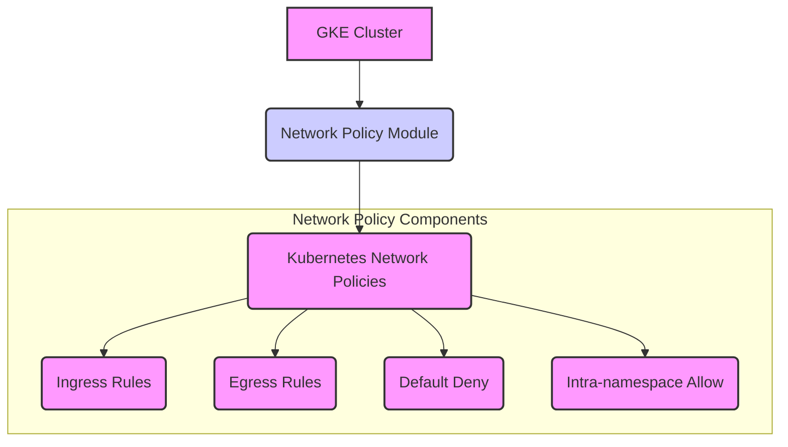

# Network Policy Module

This module configures Kubernetes Network Policies for a GKE cluster using Calico. It provides options for implementing default deny policies, controlling ingress and egress traffic, and defining application-specific rules.

## Features

*   Configures Calico Network Policies.
*   Optionally implements default deny ingress and/or egress policies.
*   Allows defining ingress rules based on pod labels and ports.
*   Allows defining egress rules based on CIDRs, ports, and pod labels.
*   Optionally allows intra-namespace communication.
*   Input validation for key variables.

## Usage

This module is typically called from an environment-specific `main.tf` file (e.g., `environments/dev/main.tf`). It is often made conditional based on an environment variable.

```terraform
module "network_policy" {
  source = "../../modules/network-policy"
  count  = var.deploy_network_policies ? 1 : 0 # Example: Make module deployment conditional

  namespace              = "default" # Example: Apply to the default namespace
  master_ipv4_cidr_block = var.master_ipv4_cidr_block # Required for GKE control plane access
  enable_default_policies = true # Example: Enable default deny ingress
  restrict_egress         = false # Example: Do not restrict egress by default

  # Example: Allow ingress to a demo app on port 8080 from pods with label app=demo-app
  enabled_apps_ingress = {
    "demo-app" = {
      port = 8080
      protocol = "TCP"
      from_pod_labels = {
        "app" = "demo-app"
      }
    }
  }

  # Example: Allow egress from pods with label app=backend to an external service
  # allow_external_egress = true # Must be true to use external_egress_cidrs
  # external_egress_cidrs = {
  #   "external-api" = {
  #     cidr = "203.0.113.0/24"
  #     port = 443
  #     protocol = "TCP"
  #     pod_labels = {
  #       "app" = "backend"
  #     }
  #   }
  # }

  depends_on = [module.gke] # Depends on the GKE cluster being created with network policy enabled
}
```

## Inputs

| Name                             | Description                                                                 | Type                                                                 | Default     | Required |
| :------------------------------- | :-------------------------------------------------------------------------- | :------------------------------------------------------------------- | :---------- | :------- |
| `namespace`                      | Kubernetes namespace to apply the network policies                          | `string`                                                             | `"default"` | no       |
| `enable_default_policies`        | Whether to enable default deny ingress policies                             | `bool`                                                               | `true`      | no       |
| `restrict_egress`                | Whether to restrict egress traffic (enables default deny egress if true)    | `bool`                                                               | `false`     | no       |
| `master_ipv4_cidr_block`         | IP CIDR block of the GKE master (required for control plane communication)  | `string`                                                             | n/a         | yes      |
| `enable_intra_namespace_communication` | Whether to allow pods within the same namespace to communicate            | `bool`                                                               | `true`      | no       |
| `app_label_selector`             | Label selector to use for intra-namespace communication (e.g., `app = "app"`) | `map(string)` | `{ app = "app" }` | no       |
| `enabled_apps_ingress`           | Map of applications to allow ingress to specific ports. Keys are arbitrary names, values are objects with `port`, `protocol`, and `from_pod_labels`. | `map(object({ port = number, protocol = string, from_pod_labels = map(string) }))` | `{}`        | no       |
| `allow_external_egress`          | Whether to allow egress to external services (requires `restrict_egress = true`) | `bool` | `false` | no       |
| `external_egress_cidrs`          | Map of external CIDRs to allow egress to. Keys are arbitrary names, values are objects with `cidr`, `port`, `protocol`, and `pod_labels`. | `map(object({ cidr = string, port = number, protocol = string, pod_labels = map(string) }))` | `{}`        | no       |

## Outputs

| Name                 | Description                                    |
| :------------------- | :--------------------------------------------- |
| `namespace`          | The Kubernetes namespace the policies are applied to |

## Architecture Diagram (Conceptual)



## Considerations

*   Network Policies are enforced by the network plugin (Calico in this case). Ensure Calico is enabled on your GKE cluster.
*   Implementing default deny policies requires careful planning to ensure all necessary traffic is explicitly allowed. Start with a permissive policy and gradually lock it down.
*   Test your network policies thoroughly in a non-production environment before applying them to production.
