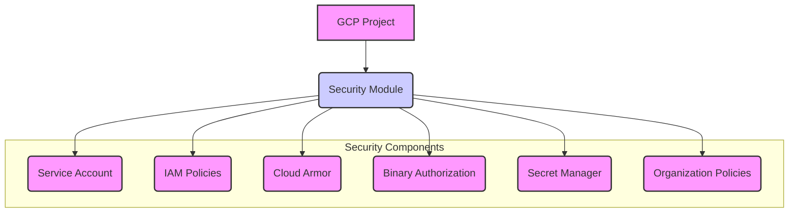

# Security Module

This module configures security-related resources for a GCP project intended to host a GKE cluster. This includes creating a dedicated service account for the GKE nodes and optionally configuring features like Cloud Armor, Binary Authorization, Secret Manager, and Organization Policies.

## Features

*   Creates a dedicated Google Cloud Service Account for GKE nodes, following the principle of least privilege.
*   Optionally configures Cloud Armor security policies.
*   Optionally configures Binary Authorization for enforcing trusted container images.
*   Optionally manages secrets using Google Secret Manager.
*   Optionally applies organization policies for project-level constraints.
*   Input validation for key variables.

## Usage

This module is typically called from an environment-specific `main.tf` file (e.g., `environments/dev/main.tf`).

```terraform
module "security" {
  source = "../../modules/security"

  project_id            = var.project_id
  project_name          = var.project_name
  service_account_id    = "${var.project_name}-gke-sa" # Example: Naming convention for SA
  cluster_name          = "${var.project_name}-cluster" # Used for IAM bindings if needed
  enable_cloud_armor    = false # Example: Disable Cloud Armor in dev
  enable_binary_authorization = false # Example: Disable Binary Auth in dev
  attestor_public_key   = var.binary_authorization_attestor_public_key # Required if enable_binary_authorization is true
  enable_secret_manager = false # Example: Disable Secret Manager in dev
  secrets               = var.application_secrets # Example: Pass secrets map (sensitive)
  apply_org_policies    = false # Example: Do not apply org policies in dev
}
```

## Inputs

| Name                          | Description                                                                 | Type     | Default       | Required |
| :---------------------------- | :-------------------------------------------------------------------------- | :------- | :------------ | :------- |
| `project_id`                  | The ID of the project where resources will be created                       | `string` | n/a           | yes      |
| `project_name`                | The name of the project (used for naming resources)                         | `string` | n/a           | yes      |
| `service_account_id`          | ID for the GKE service account (will be prefixed with project ID)           | `string` | `"gke-node-sa"` | no       |
| `cluster_name`                | Name of the GKE cluster (used for IAM bindings if needed)                   | `string` | n/a           | yes      |
| `enable_cloud_armor`          | Whether to enable Cloud Armor security policies                             | `bool`   | `false`       | no       |
| `enable_binary_authorization` | Whether to enable Binary Authorization                                      | `bool`   | `false`       | no       |
| `attestor_public_key`         | Public key for Binary Authorization attestor (required if `enable_binary_authorization` is true) | `string` | `""`          | no       |
| `enable_secret_manager`       | Whether to create secrets in Secret Manager                                 | `bool`   | `false`       | no       |
| `secrets`                     | Map of secrets to store in Secret Manager (sensitive)                       | `map(string)` | `{}`          | no       |
| `apply_org_policies`          | Whether to apply organization policies (requires Organization Admin role)   | `bool`   | `false`       | no       |

## Outputs

| Name                   | Description                                    |
| :--------------------- | :--------------------------------------------- |
| `service_account_email`| The email address of the created service account |
| `service_account_id`   | The unique ID of the created service account   |

## Architecture Diagram (Conceptual)



## Considerations

*   Ensure the Terraform service account has the necessary IAM permissions to create and manage service accounts, IAM policies, and other security resources.
*   Implementing Binary Authorization requires setting up attestors and policies outside of this module. This module only enables the feature on the cluster and can optionally configure the attestor.
*   Managing secrets in Secret Manager is recommended over storing them directly in code or variables.
*   Applying organization policies can have wide-ranging impacts; ensure you understand the policies being applied.
