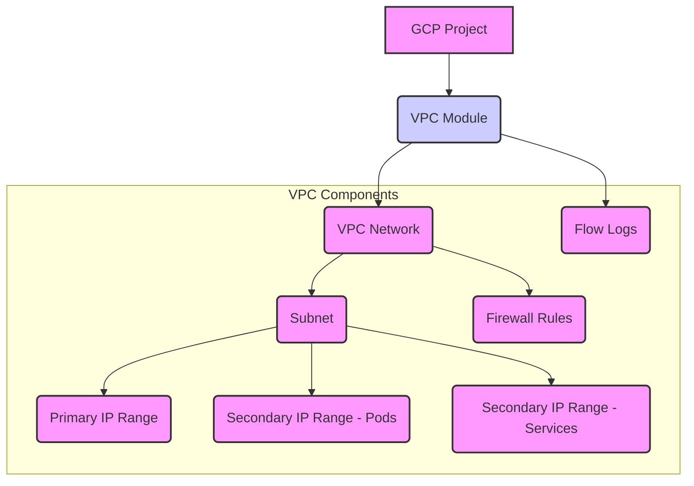

# VPC Module

This module creates a Google Cloud Platform (GCP) Virtual Private Cloud (VPC) network and a subnetwork with secondary IP ranges for GKE Pods and Services. It includes options for creating a default deny firewall rule and enabling flow logs, which are important for network security and visibility.

## Features

*   Creates a custom VPC network.
*   Creates a subnetwork with primary and secondary IP ranges (for GKE Pods and Services).
*   Optionally creates a default deny-all ingress firewall rule.
*   Optionally enables VPC flow logs for network monitoring and analysis.
*   Input validation for key variables.

## Usage

This module is typically called from an environment-specific `main.tf` file (e.g., `environments/dev/main.tf`).

```terraform
module "vpc" {
  source = "../../modules/vpc"

  project_id             = var.project_id
  project_name           = var.project_name
  vpc_name               = "${var.project_name}-vpc"
  subnet_name            = "${var.project_name}-subnet"
  region                 = var.region
  subnet_cidr            = var.subnet_cidr
  pod_cidr               = var.pod_cidr
  service_cidr           = var.service_cidr
  master_ipv4_cidr_block = var.master_ipv4_cidr_block # Used for firewall rules if needed
  create_default_deny_rule = true # Example: Enable default deny
  enable_flow_logs       = true # Example: Enable flow logs
}
```

## Inputs

| Name                       | Description                                                                 | Type     | Default       | Required |
| :------------------------- | :-------------------------------------------------------------------------- | :------- | :------------ | :------- |
| `project_id`               | The project ID to host the network in                                       | `string` | n/a           | yes      |
| `project_name`             | The name to use in resource names                                           | `string` | n/a           | yes      |
| `vpc_name`                 | The name of the VPC network                                                 | `string` | n/a           | yes      |
| `subnet_name`              | The name of the subnet                                                      | `string` | n/a           | yes      |
| `region`                   | The region to host the subnet in                                            | `string` | n/a           | yes      |
| `subnet_cidr`              | The CIDR range for the subnet                                               | `string` | `"10.0.0.0/24"` | no       |
| `pod_cidr`                 | The CIDR range for pods (secondary range)                                   | `string` | `"10.1.0.0/16"` | no       |
| `service_cidr`             | The CIDR range for services (secondary range)                               | `string` | `"10.2.0.0/16"` | no       |
| `master_ipv4_cidr_block`   | The CIDR range for GKE master (used for firewall rules)                     | `string` | `"172.16.0.0/28"` | no       |
| `create_default_deny_rule` | Whether to create a default deny-all ingress firewall rule                  | `bool`   | `true`        | no       |
| `enable_flow_logs`         | Whether to enable VPC flow logs                                             | `bool`   | `true`        | no       |

## Outputs

| Name          | Description                                    |
| :------------ | :--------------------------------------------- |
| `network_name`| The name of the created VPC network            |
| `subnet_name` | The name of the created subnetwork             |
| `subnet_self_link` | The self link of the created subnetwork   |

## Architecture Diagram (Conceptual)



## Considerations

*   Ensure the CIDR ranges for the subnet, pods, and services do not overlap and are appropriately sized for your expected workload.
*   The default deny rule enhances security but requires explicit allow rules for necessary traffic (e.g., GKE control plane, SSH for debugging if needed, application traffic).
*   VPC flow logs can generate significant data; configure them and set up sinks (e.g., to Cloud Storage, BigQuery, Pub/Sub) based on your logging and monitoring strategy.
